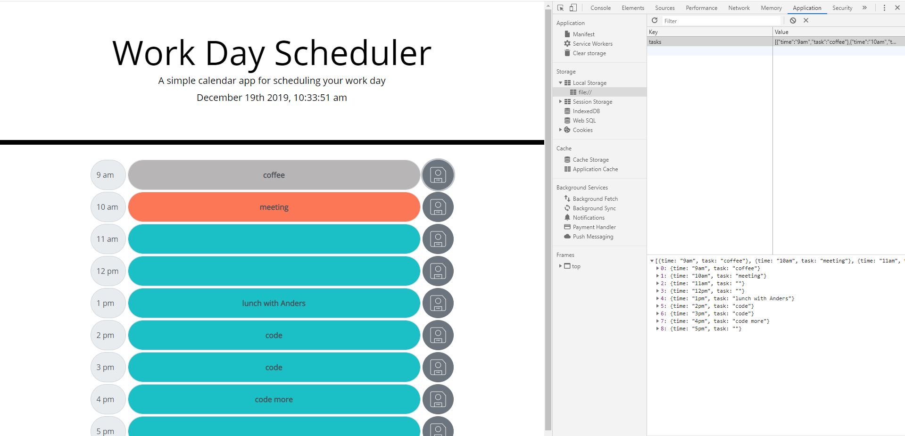
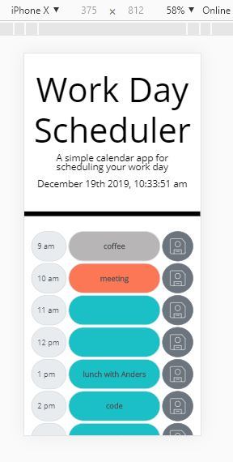

# Day Planner
Repository: https://github.com/aarkitekkt/DayPlanner
URL: https://aarkitekkt.github.io/DayPlanner/
​
## Overview
​
The purpose of this application is to provide the user with a basic day planner that allows them to organize 
their schedule in hourly increments and save them to local storage so their information is not lost when the page is refreshed.  Additionaly, each hour block will be assigned a color to show if it is in the past, present, or future.
​
### Gallery
​
Home:

Local Storage:

​
Responsive Design:

​
### Problem
The biggest challenge faced with this application was figuring out how to first, define the blank array that tasks are placed into and then replacing that initial variable with the array pulled from local storage.  I struggled with the local storage array being reset to its default blank state when the page was being reloaded.
​
### Solution
​
My solution was to assign the global variable as tge array pulled from local storage.  When the page is loaded for the first time, or the local storage is cleared, I used an if statement to determine if there was any data in local storage and if not, dynamically create the array and save it to local storage.
​
## Tech and Features Used
​
* Bootstrap
* Javascript
* Moment.js
* jQuery

​
## How to use
​
Simply type a task in the appropriate hour field and click the save button next to the task.
​
## Technical Overview
​
1. The main array (tasks) contains an object showing the time and task for each hour listed and is pulled from local storage.
2. A funtion (initiateTasks) runs to check if the tasks array contains any data.  If it does not, a function generates the array of objects showing the time and a blank task. If there is already data stored in local storage, a different function (showTasks) loops through the array and renders each task in the appropriate time block.
3. Using moment.js, the current day and time are rendered into a 
 in the jumbotron element.
4. A function (colorTimeBlocks) pulls the current hour from moment.js and compares that to each time blocks "data-hour" attribute and given whether it is less than, equal to, or greater, assigns a color to each time block to display if it is past, present, or future.
5. When the user types a task into a time block and clicks the save icon, a fumction then takes that input, grabs its "data-index" attribute and splices the new object into the tasks array, replacing the old object in that index position.
6. This array is saved in local storage so the information is not lost when the page is re loaded.
